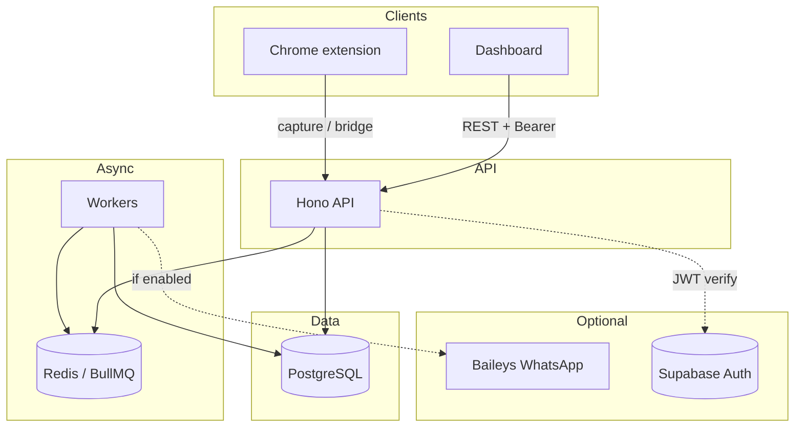
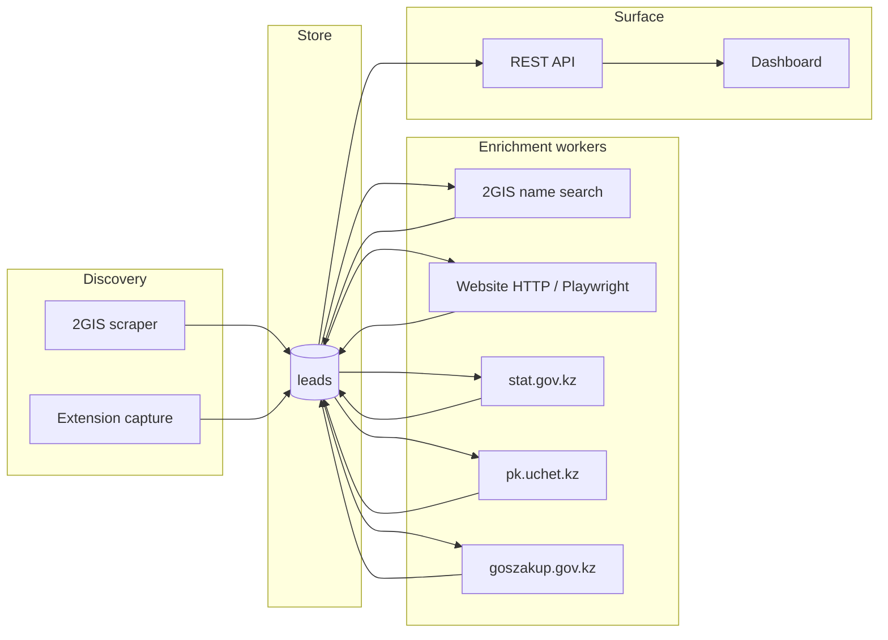
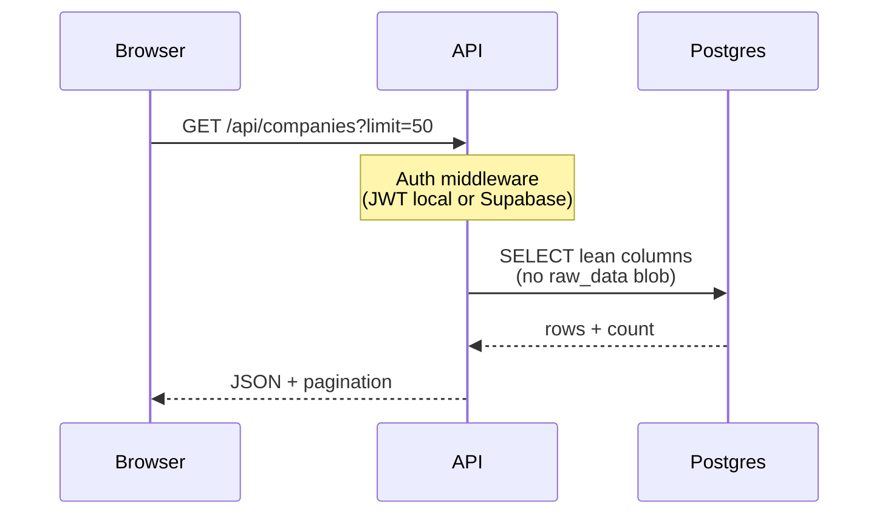
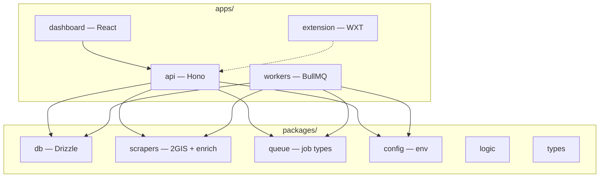
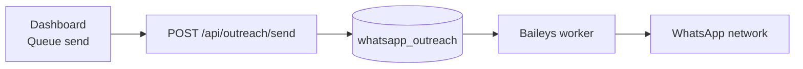

<div align="center">

<pre>
┌─────────────────────────────────────────────────────────────────────┐
│                                                                     │
│   ██╗     ███████╗ █████╗ ██████╗ ██╗██╗   ██╗ █████╗               │
│   ██║     ██╔════╝██╔══██╗██╔══██╗██║╚██╗ ██╔╝██╔══██╗              │
│   ██║     █████╗  ███████║██║  ██║██║ ╚████╔╝ ███████║              │
│   ██║     ██╔══╝  ██╔══██║██║  ██║██║  ╚██╔╝  ██╔══██║              │
│   ███████╗███████╗██║  ██║██████╔╝██║   ██║   ██║  ██║              │
│   ╚══════╝╚══════╝╚═╝  ╚═╝╚═════╝ ╚═╝   ╚═╝   ╚═╝  ╚═╝              │
│                                                                     │
│        Lead intelligence for Kazakhstan · monorepo stack            │
│                                                                     │
└─────────────────────────────────────────────────────────────────────┘
</pre>

[](https://github.com/DaurenNope/leadiya/actions/workflows/ci.yml)
[](https://nodejs.org/)
[](https://www.postgresql.org/)
[](https://redis.io/)
[](https://www.typescriptlang.org/)

[Repository](https://github.com/DaurenNope/leadiya) · [Issues](https://github.com/DaurenNope/leadiya/issues) · [Docs](./docs/)

</div>

---

## At a glance

| Layer | What runs | Port / surface |
|-------|-----------|----------------|
| **UI** | React + Vite + Tailwind dashboard | `:5173` (dev) |
| **API** | Hono + Zod + Drizzle | `:3001` (dev) |
| **Workers** | BullMQ consumers (discovery, enrichment, optional WhatsApp) | background |
| **Data** | PostgreSQL + Redis | your infra / Supabase |

---

## System map

High-level: who talks to whom.



---

## Lead pipeline

From directory listing to enriched records.



---

## Request path (dashboard → data)

Typical read: list companies with filters.



---

## Monorepo topology



---

## Optional: WhatsApp (Baileys)



Enable with `WHATSAPP_BAILEYS_ENABLED=true`, run workers, scan QR once. See [.env.example](./.env.example).

---

## Requirements

- **Node.js** 20+ (CI uses 22)
- **PostgreSQL** — local or [Supabase](https://supabase.com/) Postgres
- **Redis** — BullMQ

---

## Quick start

```bash
git clone https://github.com/DaurenNope/leadiya.git
cd leadiya

npm install --legacy-peer-deps

cp .env.example .env
# Set DATABASE_*, REDIS_URL, and AUTH_BYPASS=true OR Supabase keys

npm run build
npm test
npm run dev
```

| Tip | |
|-----|---|
| Local auth | `AUTH_BYPASS=true` skips JWT on `/api/*` (dev only). |
| Supabase egress | Set `SUPABASE_JWT_SECRET` for local JWT verification → fewer Auth round-trips. [Details →](./docs/SUPABASE_FREE_TIER.md) |

---

## Database

```bash
npm run db:migrate -w @leadiya/db
npm run db:generate -w @leadiya/db   # after schema edits
npm run db:seed -w @leadiya/db       # optional
```

---

## Workspace reference

| Path | Role |
|------|------|
| `apps/api` | REST: companies, leads, scrapers, outreach, Stripe |
| `apps/dashboard` | Operator UI |
| `apps/workers` | Discovery, enrichment, optional Baileys |
| `apps/extension` | 2GIS-assisted capture |
| `packages/db` | Schema + migrations + `db` client |
| `packages/scrapers` | 2GIS, Playwright, KZ APIs |
| `packages/queue` | Shared queue names + payloads |
| `packages/config` | Zod `env` |
| `packages/logic` | Lead factory / ICP helpers |
| `packages/types` | Shared TS |

---

## Environment

Copy **[.env.example](./.env.example)** → `.env`.

**Core:** `DATABASE_URL`, `DATABASE_DIRECT_URL`, `REDIS_URL`  
**Auth:** `AUTH_BYPASS` or `SUPABASE_*` + recommended `SUPABASE_JWT_SECRET`  
**WhatsApp:** `WHATSAPP_BAILEYS_ENABLED`, `WHATSAPP_BAILEYS_AUTH_DIR`  
**Tuning:** `SCRAPER_RUNS_CACHE_MS`, `STAGE2_HTTP_ONLY`, `TWOGIS_CHECKPOINT_DIR`

---

## Documentation index

| Doc | Topic |
|-----|--------|
| [docs/SUPABASE_FREE_TIER.md](./docs/SUPABASE_FREE_TIER.md) | Egress-aware Postgres + auth |
| [docs/TESTING.md](./docs/TESTING.md) | Vitest |
| [docs/progress/STATUS.md](./docs/progress/STATUS.md) | Status |
| [docs/progress/PLAN_MVP_AND_ROADMAP.md](./docs/progress/PLAN_MVP_AND_ROADMAP.md) | Roadmap |
| [docs/progress/2GIS_STRATEGY.md](./docs/progress/2GIS_STRATEGY.md) | 2GIS |
| [docs/progress/DATA_COLLECTION_100K_PLAN.md](./docs/progress/DATA_COLLECTION_100K_PLAN.md) | Scale to ~100k |
| [docs/progress/EXTENSION_UTILIZATION.md](./docs/progress/EXTENSION_UTILIZATION.md) | Extension vs scraper |

---

## Scripts

```bash
npm run build    # turbo build
npm run dev      # turbo dev
npm run lint
npm test         # vitest

npx tsx --env-file=.env scripts/evaluate-leads-quality.ts
npx tsx --env-file=.env scripts/broader-2gis-sample.ts
```

---

## CI & Docker

- **CI:** [.github/workflows/ci.yml](./.github/workflows/ci.yml) — build, lint, test on `main` / PRs.

```bash
docker build --target api -t leadiya-api .
docker build --target workers -t leadiya-workers .
docker build --target dashboard -t leadiya-dashboard .
```

---

## Contributing

```bash
git add -A && git commit -m "feat: …" && git push origin main
```

Use `npm install --legacy-peer-deps` if npm reports peer conflicts in the workspace.

---

## License

Add a `LICENSE` file when you choose one; until then, all rights reserved.

---

<div align="center">

<sub>Mermaid diagrams render on GitHub. For other viewers, use a Mermaid-compatible Markdown preview.</sub>

</div>
