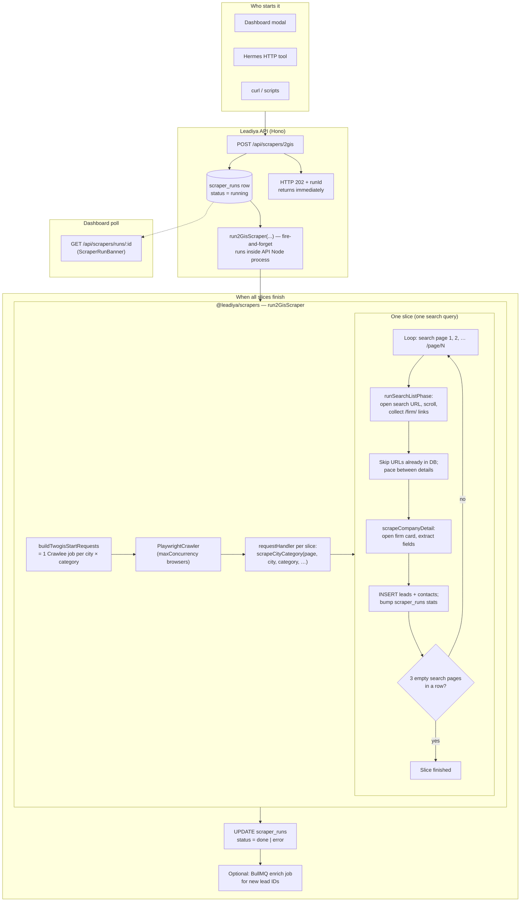
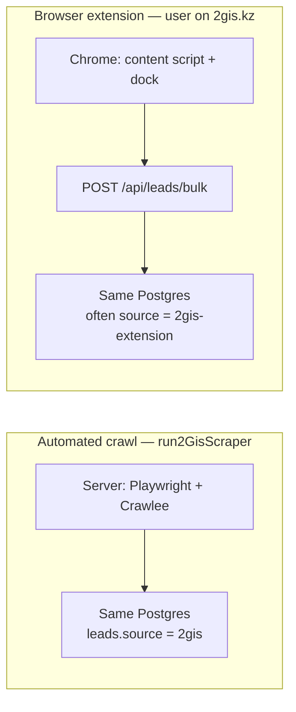

# 2GIS flows — diagrams (dashboard vs extension)

Plain-language companion to the scraper: what runs where, and why two different paths exist.

---

## 1. `run2GisScraper` — what actually runs (high level)

This is the **automated headless** pipeline started by **`POST /api/scrapers/2gis`** (dashboard, Hermes, or curl). It lives in `@leadiya/scrapers` (`run2GisScraper` → Crawlee `PlaywrightCrawler` → `scrapeCityCategory` per city×category slice).

**Reading the slice box:** for each **city + category**, the scraper opens **paginated search URLs** (`…/search/query`, then `…/page/2`, …). On each search page it collects **firm links**, then opens **each firm** in the same browser tab, saves to Postgres, and updates live counters. It stops that slice after **three consecutive search pages with zero firms** (not “only three pages ever”).

---

## 2. Why the **extension** and the **dashboard/API scraper** use different paths

They solve **different jobs** with **different runtimes**.

| | **Dashboard / API scraper** | **Extension** |
|---|-----------------------------|---------------|
| **Who drives** | Server process (no human on 2GIS) | User already browsing 2GIS |
| **Tooling** | Playwright Chromium, Crawlee queues, optional proxy | DOM in the user’s tab, queued flush to API |
| **API endpoint** | `POST /api/scrapers/2gis` → `run2GisScraper` | `POST /api/leads/bulk` (bulk payloads) |
| **Best for** | Large city×category runs, pagination, many cards | Quick capture, current page, operator workflow |
| **Same DB?** | Yes — both write **leads**; source field differs (e.g. `2gis` vs `2gis-extension`) |

So it is not “two random tools”: **one is bulk unattended scraping**, the **other is human-in-the-loop capture** into the same CRM. Hermes, if you use it, should call the **same REST** routes (`/api/scrapers/2gis` or `/api/leads/bulk` patterns) — not a third database.

---

## 3. See also

- [`docs/HERMES_INTEGRATION.md`](./HERMES_INTEGRATION.md) — agent as operator, API as system of record
- [`docs/progress/ARCHITECTURE.md`](./progress/ARCHITECTURE.md) — broader repo layout (if present)
