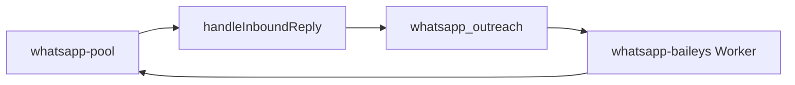
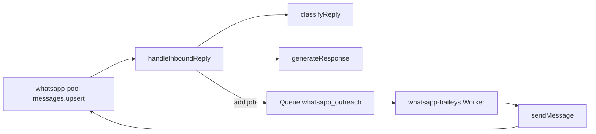

# WhatsApp agent — technical reference

Canonical architecture and operations for the in-worker WhatsApp pipeline. Product plan: [WHATSAPP_AGENT_PLAN.md](./WHATSAPP_AGENT_PLAN.md). Hermes/API bridge: [HERMES_INTEGRATION.md](./HERMES_INTEGRATION.md).

## Layers

| Layer | Role | Files |
|-------|------|--------|
| Transport | Baileys socket, inbound dedupe, JID resolution, optional `outreach_log` inbound row | `apps/workers/src/lib/whatsapp-pool.ts` |
| Decision | Classify, policy, `generateResponse`, enqueue, founder alerts, referrals | `inbound-reply.ts`, `packages/wa-reply` (`classifyReply` / `generateResponse`), `contact-extractor.ts` |
| Delivery | BullMQ consumer: business hours, Redis caps, min gap, `sendMessage` | `whatsapp-baileys.worker.ts` |

**Rule:** decision code only calls `whatsappOutreachQueue.add`; it never calls `sendMessage` directly.

Handler registration: `whatsapp-baileys.worker.ts` → `setInboundHandler(handleInboundReply)` (`handleInboundReply` re-exported from `sequence-engine.ts`).



Detailed pipeline (classifier + templates; same queue rule):



## Queue contract

Queue name: `whatsapp_outreach` (`QueueName.WHATSAPP_OUTREACH`).

Payload type `WhatsAppOutreachJobData` (`packages/queue/src/index.ts`):

| Field | Required | Notes |
|-------|----------|--------|
| `phoneDigits` | yes | E.164-style digits for `@s.whatsapp.net` |
| `body` | yes | Message text |
| `leadId` | no | Omit for some quick-sends |
| `tenantId` | no | Falls back to `DEFAULT_TENANT_ID` in worker |
| `sequenceKey`, `stepIndex` | no | Sequence steps |
| `outreachLogStatus` | no | `internal_alert` for operator pings |

## Structured logs

Workers emit one JSON object per line prefixed with **`[wa-agent]`** (grep-friendly).

**Inbound (`inbound-reply`):**

- `action: classified` — after intent resolution (`mode`: `sequence` | `no_sequence`).
- `action: queued` — after `whatsappOutreachQueue.add` (includes `jobId` when BullMQ returns it).
- `action: skipped` — `reason`: `hitl` | `negative_stop` | `meeting_handoff` (sequence path).

**Delivery (`whatsapp-worker`):**

- `action: deferred` — `deferralReason`: `business_hours` | `hour_cap` | `day_cap` (before `DelayedError`).
- `action: sent` — after successful `sendMessage`.

Implementation: `apps/workers/src/lib/wa-agent-log.ts`.

## `outreach_log.status` routing (inbound rows)

When `WHATSAPP_INBOUND_LOG` allows DB logging, `patchInboundLogStatus` updates the inbound row. Patterns (prefix `routed:`):

| Pattern | Meaning |
|---------|---------|
| `routed:{intent}:{confidence}` | No-sequence initial route |
| `routed:{intent}:{confidence}:hitl` | Low-confidence escalation |
| `routed:{intent}:{confidence}:replied` | No-sequence reply queued |
| `routed:{intent}:{confidence}:no_wa_digits` | Cannot resolve phone from JID |
| `routed:{intent}:{confidence}:no_reply_body` | `generateResponse` returned empty |
| `routed:{intent}:{confidence}:sequence` | Active sequence path |
| `routed:{intent}:{confidence}:sequence:hitl` | Sequence HITL |
| `routed:{intent}:{confidence}:sequence:negative` | Stop / cold |
| `routed:{intent}:{confidence}:sequence:meeting` | Meeting handoff |
| `routed:{intent}:{confidence}:sequence:replied` | Sequence reply queued |
| `routed:{intent}:{confidence}:sequence:no_wa_digits` | Sequence, no digits |
| `routed:{intent}:{confidence}:sequence:no_reply_body` | Sequence, no body |

When inbound logging is disabled, auto-reply logic still runs; only DB stamps are skipped for inbound text.

### M2 — Branch → final `outreach_log.status` (audit)

`patchInboundLogStatus` runs only when `meta.inboundLogId` is set (inbound row inserted — see `WHATSAPP_INBOUND_LOG` / Baileys path). Terminal suffix wins if multiple patches occur in one turn (e.g. sequence path first stamps `:sequence`, then overwrites with `:sequence:hitl`).

| Branch | Final `status` prefix (after `routed:`) |
|--------|----------------------------------------|
| No sequence, after classify | `{intent}:{confidence}` |
| No sequence, HITL (low + blocked intent) | `…:hitl` |
| No sequence, reply queued | `…:replied` |
| No sequence, no phone digits | `…:no_wa_digits` |
| No sequence, empty body | `…:no_reply_body` |
| Active sequence, after classify | `…:sequence` → may be overwritten below |
| Active sequence, HITL | `…:sequence:hitl` |
| Active sequence, negative / stop | `…:sequence:negative` |
| Active sequence, meeting handoff | `…:sequence:meeting` |
| Active sequence, reply queued | `…:sequence:replied` |
| Active sequence, no digits | `…:sequence:no_wa_digits` |
| Active sequence, empty body | `…:sequence:no_reply_body` |

Source: `apps/workers/src/workers/inbound-reply.ts` (`patchInboundLogStatus` call sites).

## Environment (worker-relevant)

| Variable | Effect |
|----------|--------|
| `WHATSAPP_BAILEYS_ENABLED` | Load Baileys worker |
| `DEFAULT_TENANT_ID` | Default queue tenant |
| `WHATSAPP_INBOUND_LOG` | Persist inbound to `outreach_log` (see `isWhatsappInboundLogEnabled` in `@leadiya/config`) |
| `WHATSAPP_BUSINESS_HOURS_DISABLED` | Skip business-hours deferral in worker |
| `WHATSAPP_BUSINESS_HOURS_*` | TZ / window |
| `WHATSAPP_MIN_SEND_GAP_MS`, `WHATSAPP_MAX_SEND_GAP_JITTER_MS` | Inter-send wait |
| `OUTREACH_MAX_INBOUND_AUTO_REPLIES` | Rolling cap per lead (no-sequence + sequence auto paths) |
| `OUTREACH_AUTO_REPLY_LOW_CONFIDENCE` | Relax low-confidence escalation |
| `FOUNDER_WHATSAPP` | Digits for founder alert queue jobs (`internal_alert`) |
| `NODE_ENV` | With unset `WHATSAPP_BUSINESS_HOURS_DISABLED`, dev skips business-hours deferral (see `isWhatsappBusinessHoursDisabled`) |
| `OLLAMA_URL` / `OPENAI_API_KEY` | Classifier / auto-responder (see `packages/wa-reply`) |
| `WA_AGENT_CONFIG_DIR` | Optional: absolute path to YAML (`business.yml`, `sequences.yml`). Workers default to `apps/workers/config` at runtime; API **simulator** (`wa-simulate-reply.ts`) defaults to that path relative to the API build if unset. |

`WHATSAPP_BUSINESS_HOURS_TZ` / `_START` / `_END` are read in `whatsapp-baileys.worker.ts` (defaults Almaty 9–19) — not all are in the zod schema; see worker and `.env.example`.

Full schema: `packages/config/src/index.ts`, `.env.example`.

## M7 — Sales-agent contract (automation boundary)

**Sources of truth for “what the bot says”:** merged YAML sequences (`config/business.yml`, tenant sequences), `packages/wa-reply` (`generateResponse`), and keyword/LLM classification (`classifyReply`). **Transport** never changes copy — only `whatsapp-baileys.worker.ts` delivery policy.

### Policy knobs (not “full autopilot” by default)

| Mechanism | Config / code | Effect |
|-----------|----------------|--------|
| Low-confidence escalation | `OUTREACH_AUTO_REPLY_LOW_CONFIDENCE`, `allowLowConfidenceAutoReply()`, `lowConfidenceBlocksAutoReply` | Meeting / referral / negative at **low** confidence → HITL (no auto body) when policy is strict |
| Rolling auto-reply cap | `OUTREACH_MAX_INBOUND_AUTO_REPLIES`, `maxInboundAutoReplies()` | Stops templated auto-replies; founder alert path |
| Founder alerts | `FOUNDER_WHATSAPP`, `shouldSendFounderAlert`, `worker-business-config` | Separate queue jobs with `internal_alert` |
| Negative / stop | `inbound-reply.ts` sequence branch | Lead → cold, pending WA jobs removed |
| Delivery deferral | `whatsapp-baileys.worker.ts`, Redis `wa:rate:*` | Jobs **delayed** — not dropped (see `deferralReason`) |

### Intent → typical outcome (aligned with `classifyReply` + `inbound-reply`)

Intents: `positive`, `negative`, `pricing`, `timeline`, `meeting`, `referral`, `question`, `qualification`, `unknown` (see `packages/wa-reply/src/intent-classifier.ts`).

| Intent | No active sequence | Active sequence |
|--------|-------------------|-----------------|
| **positive** / **pricing** / **question** / **timeline** | After caps/HITL checks: `generateResponse` → usually **queue** if body + digits | Same logic on sequence path; sequence state updated |
| **qualification** | Promoted from positive/question/unknown when extracted qualification fields present | Same |
| **meeting** | User message routed; reply per templates unless HITL blocks | Sequence often **completed**, **no** auto customer body; founder alert; see `sequence:meeting` |
| **referral** | `processReferral` if phone extracted; else normal reply path | `processReferral` with sequence key |
| **negative** | Routed; reply if policy allows | **Cold** lead, WA jobs for lead removed; `negative_stop` log |
| **unknown** (often low conf.) | May hit HITL if combined with blocked intents at low confidence | Same |

**Stakeholder sign-off (copy to ticket / doc):**

| Question | Answer (fill in) |
|----------|-------------------|
| Product accepts caps + HITL + founder alerts as the default safety model? | Y / N |
| Which intents must never auto-reply without human review? | |
| Max auto-replies per lead (`OUTREACH_MAX_INBOUND_AUTO_REPLIES`) acceptable default? | |
| Business-hours deferral acceptable for production TZ? | |
| Signed | Name, date |

## API / operator

- Outbound enqueue: `POST /api/outreach/*` — `apps/api/src/routes/outreach.ts`
- **Simulator (no DB/queue):** `POST /api/outreach/simulate-reply` — same classify + no-sequence `generateResponse` path as workers; body validated in route; implementation `apps/api/src/lib/wa-simulate-reply.ts` (uses `@leadiya/wa-reply`).
- Admin queue: `GET/POST /api/admin/...` — `admin-operations.ts`, `admin.ts`
- Dashboard: `ControlCenterView.tsx`, `WhatsAppConnectPanel.tsx`, `WhatsAppInboxView.tsx`, **`ScriptSimulatorView.tsx`** (calls `simulate-reply`)

## M6 — Communication proof (staging / local)

**Automated preflight (no device needed for exit code):** from repo root with API + Redis + Postgres reachable and `.env` loaded:

```bash
npm run check:wa-stack
```

Exit **0** = health, Redis, Postgres, `WHATSAPP_BAILEYS_ENABLED`, `DEFAULT_TENANT_ID`, BullMQ queue reachable; optional `wa:status:*` and service-key status call. Exit **non-zero** = fix FAIL lines first.

**Manual checklist (device / real session):**

1. API `GET /health` 200; Redis/Postgres up (or use `check:wa-stack` above).
2. `npm run dev:workers` (or your process manager); `WHATSAPP_BAILEYS_ENABLED=true`; Baileys **connected** for tenant (Redis `wa:status:*` or dashboard).
3. Inbound path: send a WhatsApp message to the connected number **or** run `npm run simulate:wa-convo` (see `scripts/simulate-wa-convo.ts` for `SKIP_SEND`, `LEADIYA_VERIFY_*` env). Worker logs should show `[wa-agent]` with `action: classified` and often `queued` or `skipped` with a reason.
4. If BullMQ **delayed** > 0: grep `[wa-agent]` for `deferralReason` (`business_hours`, `hour_cap`, `day_cap`) or Control Center delayed callout.
5. Confirm **outbound on device** when not deferred (rate limits / gap allow send).

**M6 sign-off (one successful run):**

| Field | Value |
|-------|--------|
| Environment | e.g. local / staging |
| Date | |
| `check:wa-stack` exit 0 | Y / N |
| Inbound + `[wa-agent]` seen | Y / N |
| Outbound received on phone (or dry-run documented) | Y / N |
| Operator | |

## Module index

| Module | Path |
|--------|------|
| Pool | `apps/workers/src/lib/whatsapp-pool.ts` |
| Inbound reply | `apps/workers/src/workers/inbound-reply.ts` |
| Sequence engine + re-export | `apps/workers/src/workers/sequence-engine.ts` |
| Baileys worker | `apps/workers/src/workers/whatsapp-baileys.worker.ts` |
| Worker entry | `apps/workers/src/start-workers.ts`, `apps/workers/src/main.ts` |
| Intent + auto-responder (shared) | `packages/wa-reply/src/intent-classifier.ts`, `packages/wa-reply/src/auto-responder.ts` |
| Inbound playbook (keyword replies before clarifier/LLM) | `apps/workers/config/inbound-playbook.yml` (see `inbound-playbook.example.yml`), loaded by `packages/wa-reply/src/inbound-playbook.ts` |
| API reply simulator | `apps/api/src/lib/wa-simulate-reply.ts` |
| Referral CRM | `apps/workers/src/lib/contact-extractor.ts` |
| Caps | `apps/workers/src/lib/inbound-auto-reply-limits.ts` |
| Business YAML | `apps/workers/config/business.yml`, `worker-business-config.ts` |
| Agent log helper | `apps/workers/src/lib/wa-agent-log.ts` |
| Business-hours math | `apps/workers/src/lib/whatsapp-business-hours.ts` |
| Outbound API | `apps/api/src/routes/outreach.ts` |
| Admin / ops summary | `apps/api/src/routes/admin.ts`, `apps/api/src/lib/admin-operations.ts` |
| Dashboard | `ControlCenterView.tsx` (queue + health), `OverviewView.tsx`, `WhatsAppConnectPanel.tsx`, `WhatsAppInboxView.tsx`, `ScriptSimulatorView.tsx` (`apps/dashboard/src/components/`) |

## Milestone sign-off (M1–M4)

Engineering baseline. When green, proceed to **M5–M7** (below): CI tests, then stack/in-person proof (M6), then stakeholder contract (M7).

| ID | Checkpoint | Done |
|----|------------|------|
| **M1** | This doc: layers, both mermaid diagrams, queue contract, module index (table above), env table, API pointers, staging checklist (M6) and sales matrix (M7) present. | [x] |
| **M2** | `outreach_log.status` vocabulary + branch table (above) matches `patchInboundLogStatus` in `inbound-reply.ts`. | [x] |
| **M3** | `[wa-agent]` fields for `inbound-reply` + `whatsapp-worker` match § Structured logs; grep-friendly. | [x] |
| **M4** | Control Center: `whatsapp_outreach` counts, merged WA status, env flags, failed sample; when **delayed > 0**, prominent note + `[wa-agent]` / TECH pointer (see dashboard). | [x] |

## M5 — Regression gate (CI + local)

- **CI:** `.github/workflows/ci.yml` runs **`npm run test:wa-agent`** (fast subset) then **`npx vitest run`** (full monorepo) on push/PR to `main`. Regressions in classifier, enqueue mocks, or WA helpers fail the build.
- **Local quick:** `npm run test:wa-agent`
- **Local full:** `npm test` (same as CI’s second step)

## Testing

| Suite | File | What it covers |
|-------|------|----------------|
| Unit | `apps/workers/src/lib/wa-agent-log.test.ts` | `[wa-agent]` JSON log shape |
| Unit | `apps/workers/src/lib/whatsapp-business-hours.test.ts` | `hourInTz`, `isOutsideBusinessWindow`, `msUntilBusinessWindow` (worker deferral math) |
| Unit | `packages/wa-reply/src/intent-classifier.test.ts` | `classifyReply` keywords, `extractContactFromMessage` |
| Unit | `packages/wa-reply/src/auto-responder.test.ts` | `generateResponse` scripted paths (YAML fixtures) |
| Unit | `packages/wa-reply/src/inbound-playbook.test.ts` | Playbook match before clarifier; identity still first |
| Unit | `apps/workers/src/lib/inbound-auto-reply-limits.test.ts` | `OUTREACH_MAX_INBOUND_AUTO_REPLIES` parsing |
| Integration | `apps/workers/src/workers/inbound-reply.integration.test.ts` | `handleInboundReply` no-sequence path → mocked `whatsappOutreachQueue.add` |
| Integration | `apps/workers/src/workers/inbound-reply.integration.branches.test.ts` | HITL skip (low + meeting, low-confidence gate off) and positive path enqueue |

Run: `npm test` (full monorepo) or `npm run test:wa-agent` (only WhatsApp-agent-related suites). No Redis/Postgres required for these (integration tests use mocks).

**Not automated as Vitest:** end-to-end browser UI for the simulator, or live WhatsApp device proof — use **M6** (`check:wa-stack`, real inbound, or `npm run simulate:wa-convo` / dashboard manual check).

Helpers live in `apps/workers/src/lib/whatsapp-business-hours.ts` (used by `whatsapp-baileys.worker.ts`).

## Hardcore testing playbook (M5 → M6)

1. **Repo / CI parity:** `npm run test:wa-hardcore` — runs `test:wa-agent` then full `npm test` (belt-and-suspenders).
2. **Stack preflight:** with services running, `npm run check:wa-stack` — must exit 0 before blaming WhatsApp.
3. **Conversation dry-run / live:** `npm run simulate:wa-convo` or real inbound; tail worker stdout for `[wa-agent]`.
4. **Dashboard:** Control Center — queue counts, delayed banner, failed jobs sample.
5. **M6 / M7:** fill sign-off tables in § M6 and § M7 above.

## Milestone sign-off (M5–M7)

| ID | Checkpoint | Done |
|----|------------|------|
| **M5** | `npm run test:wa-agent` green; CI runs WA subset + full Vitest. | [x] |
| **M6** | `check:wa-stack` exit 0 on target env; inbound log line with `[wa-agent]`; outbound or documented dry-run. | [ ] |
| **M7** | Stakeholder table in § M7 completed for your org. | [ ] |
