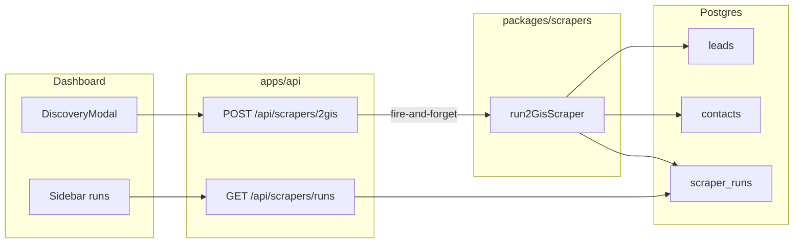

# Architecture

This is the **one normalized description** of how the system is composed. If something disagrees with this file, **this file should win** after a deliberate doc update.

## Principles (non-negotiables)

| Principle | Meaning |
|-----------|---------|
| **Browser-first 2GIS** | 2GIS data enters via **Playwright in a real browser session** (DOM and/or **network responses from that session**). We do **not** use the **paid official 2GIS Catalog HTTP API** as a product dependency (cost + fragility). |
| **Locked persistence** | Tables and columns are defined only in [`packages/db/src/schema.ts`](../../packages/db/src/schema.ts). See [GOVERNANCE.md](./GOVERNANCE.md). |
| **Scrapers in one package** | Source acquisition lives in `packages/scrapers/`. Apps call into it; scrapers do not import `apps/*`. |
| **API as orchestrator** | `apps/api` exposes HTTP for the dashboard and can start background jobs; it does not redefine schema. |

## Repository layout

```
apps/
  api/          Hono HTTP API (Node)
  dashboard/    React UI (Vite)
  workers/      BullMQ job processors
  extension/    Chrome extension (WXT)
packages/
  db/           Canonical Drizzle schema + Postgres client + leadRepository + foundation types
  scrapers/     2GIS (browser) and other sources — used by API + workers
  logic/        Lead factory + discovery import helpers
  config/       Env validation
  queue/        Queue/job typings
  types/        Shared TS interfaces (e.g. DiscoveredLead)
```

## Runtime data flow (2GIS)



## Dashboard → API

- Dev server proxies `/api` to the API (`apps/dashboard/vite.config.ts`).
- Default API port: `3041` for local CLI (`npm run dev:api`); Docker image / Compose still use `3001` unless overridden.

## Workers

- Workers under `apps/workers/src/workers/` import `@leadiya/scrapers` and `@leadiya/db` only through the public package APIs.

## Extension

- Dashboard treats extension as connected when `ws://localhost:8765` accepts a WebSocket; extension background opens that socket.

## Related research (supplementary)

- [DATA_SOURCES_RESEARCH.md](../DATA_SOURCES_RESEARCH.md)
- [FOUNDATION_BUILD_PLAN.md](../FOUNDATION_BUILD_PLAN.md) — phased vision; compare to [STATUS.md](./STATUS.md) for actual delivery.

## Schema truth

**Canonical:** `packages/db/src/schema.ts` + [GOVERNANCE.md](./GOVERNANCE.md).
